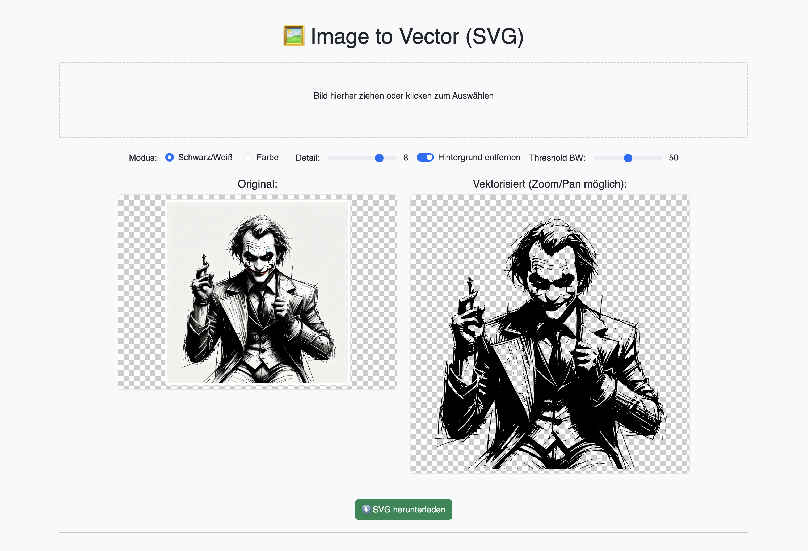

# Vectorizer Web

Vectorizer Web ist eine Webanwendung, die es ermöglicht, Rasterbilder (wie Fotos oder Zeichnungen) in skalierbare Vektorgrafiken (SVG) umzuwandeln. Die Anwendung bietet eine einfache Benutzeroberfläche zum Hochladen von Bildern und Anpassen verschiedener Vektorisierungsparameter.



## Unterstützte Dateiformate

Derzeit werden die folgenden Rasterbildformate für den Upload unterstützt:

*   PNG (`image/png`)
*   JPEG (`image/jpeg`)
*   WebP (`image/webp`)

Das Ausgabeformat ist immer SVG (`image/svg+xml`).

## Funktionsweise

Die Anwendung basiert auf Python (Flask) für das Backend und HTML, CSS und JavaScript für das Frontend.

1.  **Upload:** Der Benutzer lädt ein Bild über die Weboberfläche hoch (Drag & Drop oder Dateiauswahl).
2.  **Verarbeitung (Backend):**
    *   Das Bild wird auf dem Server im Ordner `processing/input` gespeichert.
    *   Das Backend verwendet eine externe Vektorisierungsbibliothek (vermutlich `vtracer` oder ähnlich, basierend auf den Optionen), um das Bild in SVG umzuwandeln.
    *   Optionen wie Modus (Schwarz/Weiß oder Farbe), Anzahl der Farben, Detailgrad und Hintergrundentfernung (mit Schwellenwerten) können angepasst werden.
    *   Das resultierende SVG wird im Ordner `processing/output` gespeichert.
    *   Temporäre Dateien während der Verarbeitung werden im Ordner `processing/temp` abgelegt.
3.  **Anzeige (Frontend):**
    *   Das Originalbild und die SVG-Vorschau werden nebeneinander angezeigt.
    *   Die SVG-Vorschau ist interaktiv und ermöglicht das Zoomen und Verschieben (Panning) mit der Maus dank der `svg-pan-zoom.js`-Bibliothek.
    *   Änderungen an den Vektorisierungsoptionen lösen eine Neuberechnung im Backend aus und aktualisieren die SVG-Vorschau dynamisch.
4.  **Download:** Der Benutzer kann die generierte SVG-Datei herunterladen.
5.  **Bereinigung:** Alte Dateien in den `input`-, `output`- und `temp`-Ordnern werden automatisch nach einer Stunde gelöscht, um Speicherplatz freizugeben.

## Installation und Ausführung mit Docker

Die Anwendung ist für die Ausführung in einem Docker-Container konzipiert.

1.  **Docker Image bauen:**
    Führe den folgenden Befehl im Hauptverzeichnis des Projekts aus (wo sich das `Dockerfile` befindet):

    ```bash
    docker build -t vectorizer-web --no-cache .
    ```
    *   `-t vectorizer-web`: Gibt dem Image den Namen `vectorizer-web`.
    *   `--no-cache`: Stellt sicher, dass alle Schritte neu ausgeführt werden (nützlich bei Änderungen).
    *   `.`: Gibt an, dass der Build-Kontext das aktuelle Verzeichnis ist.

2.  **Docker Container starten:**
    Führe diesen Befehl aus, um einen Container aus dem erstellten Image zu starten:

    ```bash
    docker run -p 5555:5000 --name vectorizer-web -v $(pwd)/processing:/app/processing vectorizer-web
    ```
    *   `-p 5555:5000`: Leitet Port 5555 auf dem Host-System zum Port 5000 im Container weiter (Flask läuft standardmäßig auf Port 5000).
    *   `--name vectorizer-web`: Gibt dem Container einen Namen zur einfacheren Verwaltung.
    *   `-v $(pwd)/processing:/app/processing`: Mountet den lokalen `processing`-Ordner in den `/app/processing`-Ordner im Container. Dadurch bleiben hochgeladene Bilder und generierte SVGs auch nach dem Stoppen des Containers erhalten und sind direkt auf dem Host-System zugänglich. **Wichtig:** Stelle sicher, dass der `processing`-Ordner im Projektverzeichnis existiert, bevor du den Container startest (`mkdir processing`).
    *   `vectorizer-web`: Der Name des Images, das verwendet werden soll.

3.  **Zugriff auf die Anwendung:**
    Öffne deinen Webbrowser und navigiere zu `http://localhost:5555`.

## Projektstruktur

```
.
├── Dockerfile           # Definiert das Docker-Image
├── README.md            # Diese Datei
├── app.py               # Flask Backend-Anwendung
├── processing/          # Ordner für hochgeladene und generierte Dateien (gemountet)
│   ├── input/           # Speicherort für hochgeladene Originalbilder
│   ├── output/          # Speicherort für generierte SVG-Dateien
│   └── temp/            # Speicherort für temporäre Dateien
├── requirements.txt     # Python-Abhängigkeiten
├── static/              # Statische Frontend-Dateien
│   ├── script.js        # JavaScript für Frontend-Logik
│   └── style.css        # CSS-Stile
└── templates/           # HTML-Templates (Jinja2)
    └── index.html       # Hauptseite der Anwendung
```

## Abhängigkeiten

Die Python-Abhängigkeiten sind in `requirements.txt` aufgeführt und werden beim Docker-Build automatisch installiert. Die Hauptabhängigkeiten sind:

*   Flask: Web-Framework
*   Pillow: Bildverarbeitung
*   (Implizit: Eine Vektorisierungsbibliothek wie `vtracer`, die im Dockerfile installiert wird)

Frontend-Abhängigkeiten (über CDN geladen):

*   Bootstrap 5.3.3
*   svg-pan-zoom.js 3.6.1
